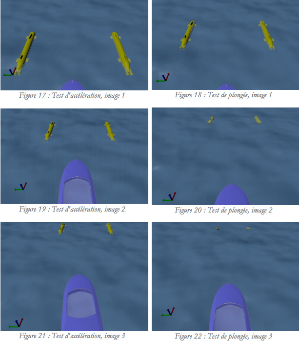

# Scout project
This is the base repository of the Scout project of [ENSTA Bretagne](http://www.ensta-bretagne.fr) 3rd year robotics engineering students.

On this image, the robots are staying in formation in front of the boat and start to dive.

The aim of this project was to design a controller and a robust observer using [interval analysis](https://www.ensta-bretagne.fr/jaulin/intervalcourse.pdf) for the localization of an underwater robot swarm.

The students had to use the [MOOS middleware](http://www.themoos.org) to make several pieces of software work together, and the [MORSE robot simulator](https://www.openrobots.org/morse/doc/latest/morse.html) to test and validate their algorithm.

My role was to teach the MORSE simulator to the students and help them during the project.

#### More reading:
- [Presentation of the project](https://www.ensta-bretagne.fr/jaulin/mer2015_projet_start.pdf): [Luc Jaulins](https://www.ensta-bretagne.fr/jaulin/) instructions about the project.
- [Instructions](http://nicolaje.github.io/morse-scout): my presentation of MORSE to the students and the instructions to build their simulations.
- [Video](http://youtu.be/ATPabRHz0LA): a video (in French) presenting the project
- [Report](https://www.ensta-bretagne.fr/jaulin/mer2015_projet.pdf): the final report (in French) written by the students.
